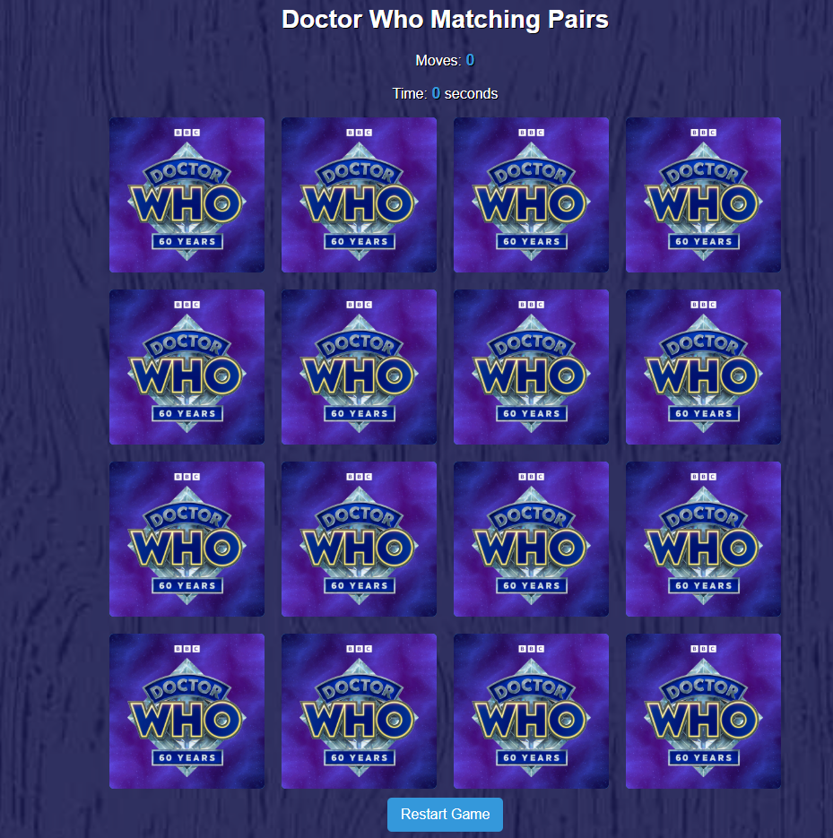

# 🎮 Doctor Who Matching Game

## 📝 About the Project
The **Doctor Who Matching Pairs Game** is a classic memory card game designed with a **Doctor Who** theme. Players flip cards to find matching pairs while keeping track of moves and time taken to complete the game.

## 🎯 Features
- **Doctor Who-themed memory card game** with vibrant card designs.
- **Move counter** to track the number of attempts.
- **Timer** to measure game completion speed.
- **High Score Table** displaying the best times and move counts.
- **Responsive Design** ensuring the game adapts to various screen sizes.
- **Smooth animations** for card flips and matching pairs.

## 🖥️ Technologies Used
- **HTML5** - Structure and layout
- **CSS3** - Styling and responsiveness
- **JavaScript (ES6+)** - Game logic and interactivity

## 📷 Screenshots


## 🚀 How to Play
1. Click on any card to reveal the Doctor Who image.
2. Click on another card to find its matching pair.
3. If the cards match, they remain visible.
4. If they don't match, they flip back over after a short delay.
5. Keep flipping cards to find all pairs in the shortest time and fewest moves.
6. Once all pairs are found, the game ends, and your time/moves are recorded.

## 🎮 Live Demo
Try the game online: [Doctor Who Matching Game](https://keirajcoder.github.io/Doctor-Who-Matcher-Game/)

## 🛠️ Installation & Running Locally
To run the game locally:
1. Clone the repository:
   ```sh
   git clone https://github.com/KeiraJCoder/Doctor-Who-Matcher-Game.git
   ```
2. Navigate into the project folder:
   ```sh
   cd Doctor-Who-Matcher-Game
   ```
3. Open `index.html` in a browser:
   ```sh
   open index.html
   ```
   Or, if using VS Code:
   ```sh
   code .
   ```

## 🛠️ Contributing
Contributions are welcome! To contribute:
1. **Fork** the repository.
2. **Clone** your forked version:
   ```sh
   git clone https://github.com/YOUR-USERNAME/Doctor-Who-Matcher-Game.git
   ```
3. **Create a new branch** for your feature:
   ```sh
   git checkout -b feature-name
   ```
4. **Commit your changes**:
   ```sh
   git commit -m "Added new feature"
   ```
5. **Push to GitHub**:
   ```sh
   git push origin feature-name
   ```
6. Create a **Pull Request** to merge your changes.

## 📝 License
This project is licensed under the **MIT License**.

## 📞 Contact
For any inquiries or feedback, reach out:
- **GitHub**: [KeiraJCoder](https://github.com/KeiraJCoder)
- **Email**: keira@example.com

